# About this repository

This repository provides the official source code to reproduce the experimental results reported in the following study.

Mei Minami, Yuka Masumoto, Yoshihiro Okawa, Tomotake Sasaki, and Yutaka Hori. [Two-step reinforcement learning for model-free redesign of nonlinear optimal regulator](https://arxiv.org/abs/2103.03808). arXiv preprint, arXiv:2103.03808v2, 2022.

# Requirements

You need the following to execute the code.  

MATLAB R2022a (ver. 9.12)  \+ Control System Toolbox R2022a (ver. 10.11.1) 


\# The code may work with other versions but we haven't tested.

# How to execute the experiments

Our proposed approach consists of Step 1 and Step 2, and the results obtained in Step 1 are used in Step 2.

To save files without error, the following function in each directory is automatically executed. 
```
../ConvertForSave.m
```
It converts '-' to 'm' and '.' to 'p' (e.g, '20XX-YY.ZZ' to '20XXmYYpZZ').

To reproduce the results of simulation shown in our paper, the following mat file is automatically loaded.  
```
rand_list_1.mat # Random number table for initial states
```
This file was generated by 
```
generate_rand_list.m
```

The variables used in the simulation are stored in the following files
```
parameter_setting.mat
```
This file was generated by 
```
parameter_setting.m
```


## 1. Step 1: design of auxiliary control law $K^{AC}$ (Experiments reported in Subsection 5.2.)
### Training and comparson of the linear auxiliary control law
To design (train) the auxiliary LQR control law $K^{AC}$ by Algorithm 1, execute the program as follows. 
```
run Journal_step1/step1_design_KAC.m
```

### Results (corresp. to Fig. 3 and Table 2 in the paper)
Through the execution of the program explained above, you obtain the following figure that shows the convergence of $K^j$ to $K^{\star}$. 

| Convergence of K^j updated by  Algorithm 1 (Fig. 3) |   
| :----: |

  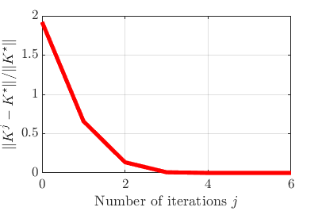    

The raw result data are stored in the following file. 
```
step1_design_KAC.mat
```

To calculate the average of the cost resulted with each controller reported in Table 2 of our paper, execute the program as follows. 
```
run Journal_step1/step1_compare_K.m
```

The raw result data are stored in the following file.
```
step1_compare_K.mat 
```

## 2. Step 2: design of nonlinear control law $\mu$ (Experiments reported in Subsection 5.3.)

### Training and evaluation of the nonlinear control laws 
To design (train) 3500 sets of nonlinear control laws, execute the program as follows. 
To change the method, select one "type" in the 17~19th line.  
**CAUTION:** If you train 3500 sets of nonlinear control laws as our paper, the program produces 3500 mat files (approx. 360MB). It took about 35 hours to simulate 3500 sets with our environment (Intel Xeon W-2265 3.50GHz and 256GB RAM).
```
run Journal_step2/step2_multiple_run_design.m # Repeat 3500 times the training of a control law 
```

To summarize data generated by the simulation above, execute the program as follows. 
```
run Journal_step2/step2_multiple_run_summarize.m # summarize data for *plot_fig4 (*step2_summarize)
```

The raw result data are stored in the following file. 
```
Journal_step2/ToFigData_R10_ver5.mat # A summary of the results of step2. It is generated by *step2_summarize.
```

To plot the average of the cost $J_{\rm fin}(k_{\rm fin})$ in each trial in Step 2 (Fig.4), execute the program as follows. 
```
run Journal_step2/step2_multiple_run_plot.m # plot fig.4 (*plot_fig4)
```

To get the average cost shown in Table 4 of our paper, execute the program as follows. 
```
run Journal_step2/compare_cost_after_step2.m # summarize data for *plot_fig4 (*step2_summarize)
```

The raw result data are stored in the following file. 
```
Journal_step2/compare_cost_after_step2.mat # A summary of the results of the average cost
```


### Results (corresp. to Fig.4 and Table 4 in the paper)
Through the execution of the program explained above, you obtain the following figures that comprise Fig.4 in the paper. 

| Average of the cost in each trial in Step 2 (main part of Fig. 4)  |  Inset of Fig.4 |
| :----------------------------------------------------------: | :----------------------------------------------------------: |
|  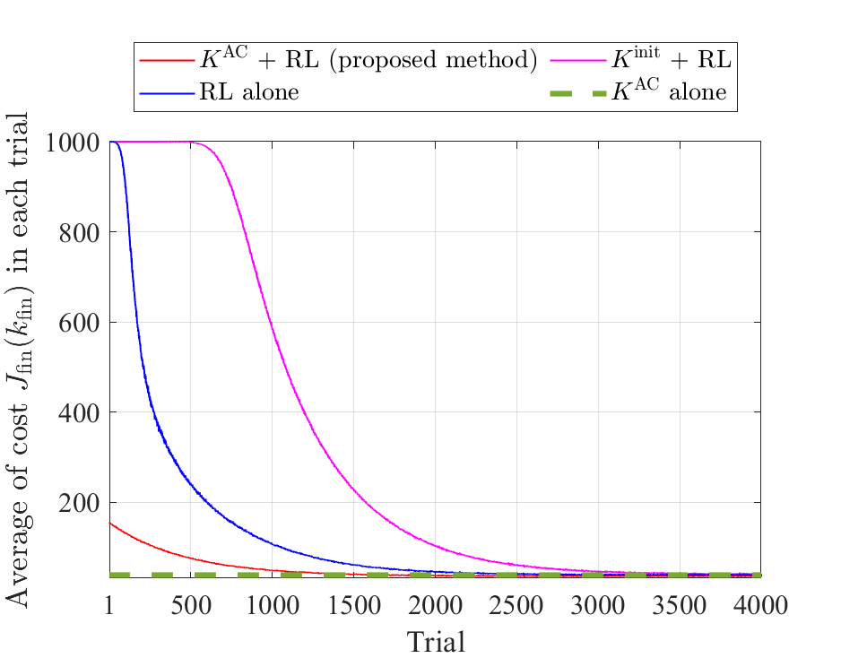  |   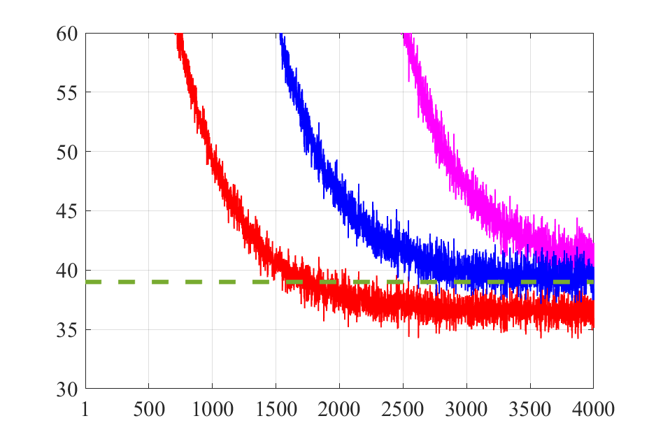   |


### Evaluation of the control laws
```
run Journal_step2/step2_save_trajectory.m # calculate trajectory by KAC+RL and KAC alone for fig.5-7 (*step2_trajectory)
run Journal_step2/step2_plot_trajectory.m # plot fig. 6,7
run Journal_step2/step2_policy_plot.m # Visualize the controller resulted from KAC+RL = plot fig.5
```
To use *step2_trajectory, select one "type" in the 14~15th line.
### Results (corresp. to Figs.5, B1, 6 in the paper)
Through the execution of the program explained above, you obtain the following figures.

| Visualization of the control law resulted from KAC + RL (Proposed method) (Fig. 5) |
| :----------------------------------------------------------: |
| 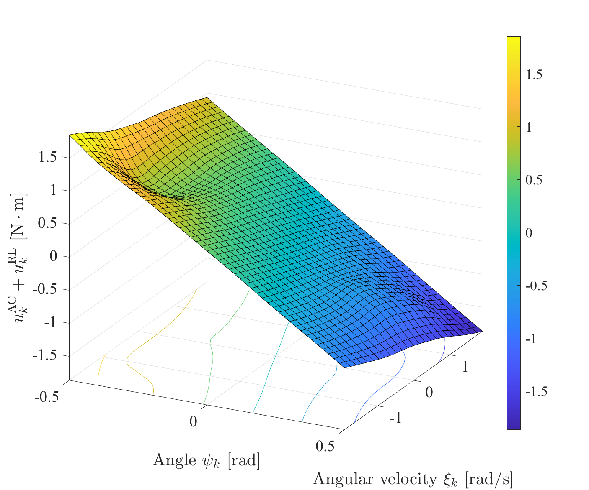  |


| Visualization of $u^{\rm AC}$  (Fig. B1(a)) | Visualization of $u^{\rm RL}$  (Fig. B1(b)) |
| :----------------------------------------------------------: |:----------------------------------------------------------: |

 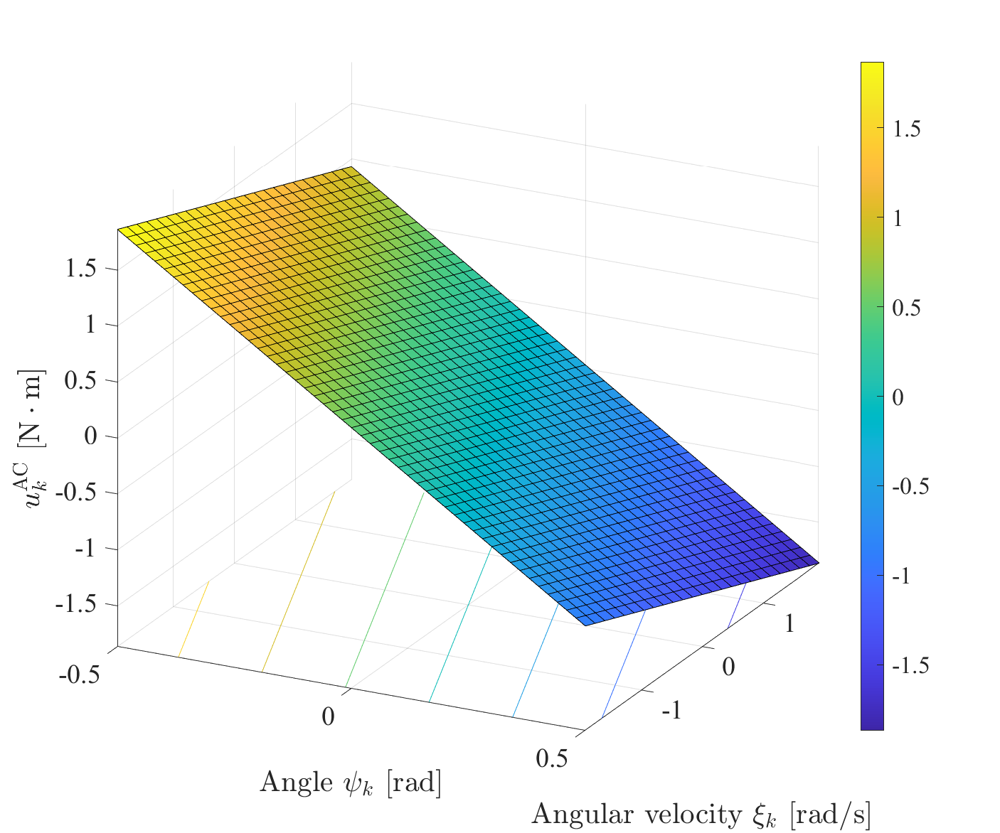  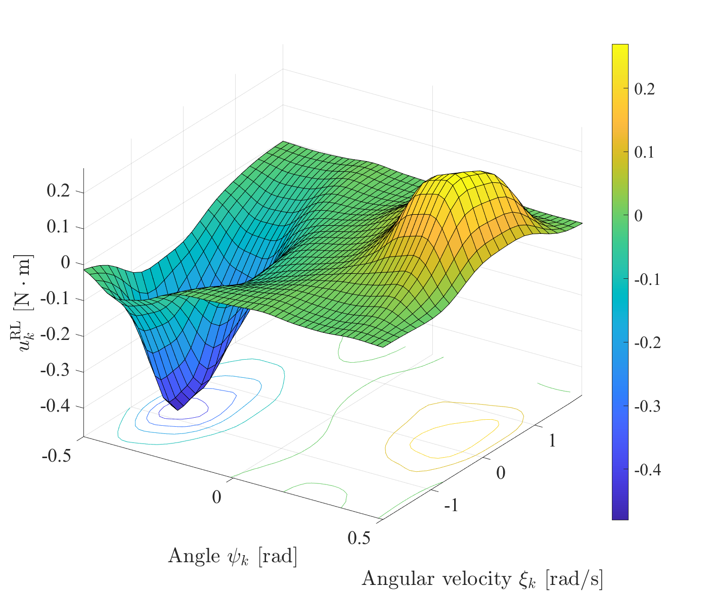  
 


|                     Trajectory of control input (Fig. 6(a))  |               Trajectory of actual (saturated) torque input  (Fig. 6(b)) |
| :----------------------------------------------------------: | :----------------------------------------------------------: |
|  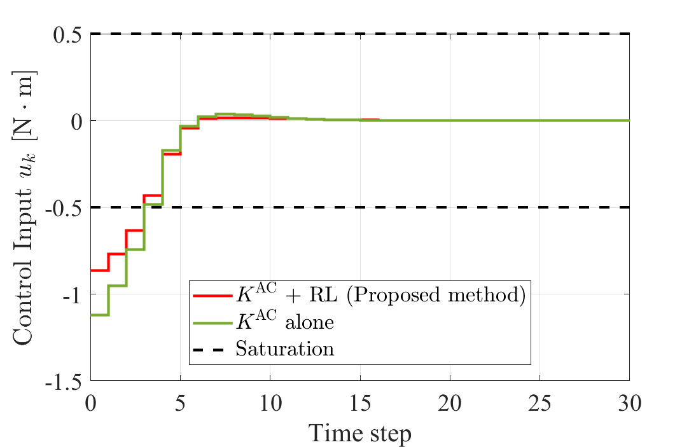   |  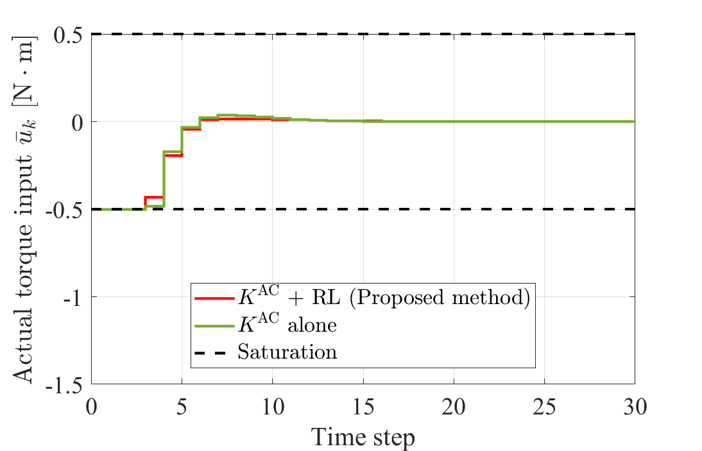   |

|                    Trajectory of angle (Fig.6(c))           |               Trajectory of angular velocity (Fig. 6(d)) |
| :----------------------------------------------------------: | :----------------------------------------------------------: |
|  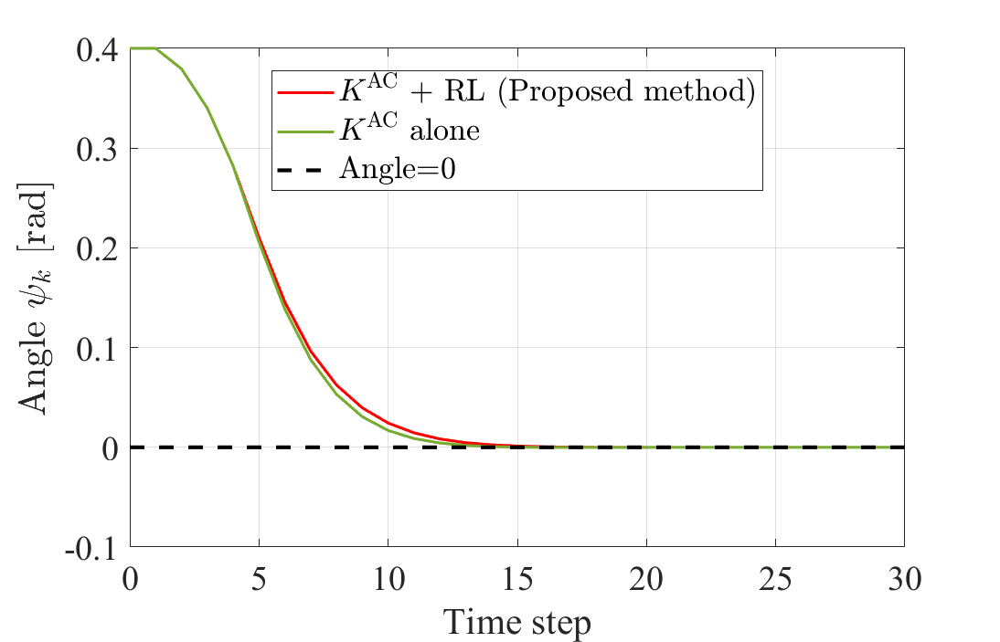   |  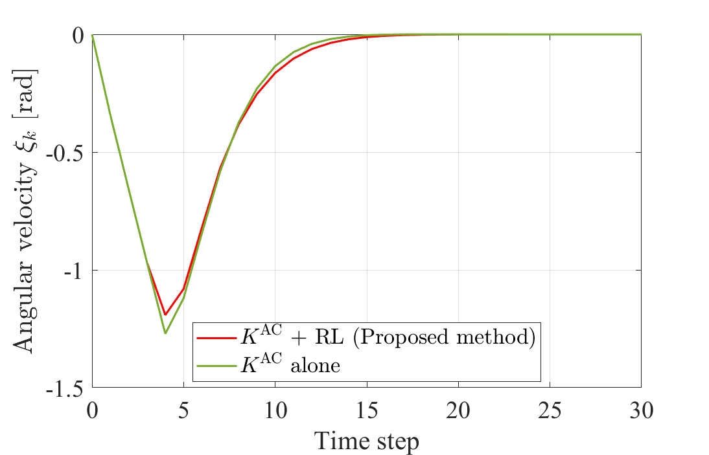   |


The raw result data are stored in the following files. 
```
Journal_step2/data_AC+RL_pnd6_St0p5_Ts0p06_p1000_beta0p0001_sigma0p1_epi4000_R10_trajectory_ver1_1.mat #  An example of the results of *step1_KAC. Used to plot trajectories form KAC+RL
Journal_step2/data_ACalone_pnd6_St0p5_Ts0p06_p1000_epi4000_R10_trajectory_ver1_1.mat #  Used to plot trajectories from KAC alone
```

## 3. EFFICIENCY OF HYPERPARAMETER TUNING (Experiments reported in Section 6)

### Training and evaluation of the control laws 
To investigate hyperparameter dependencies in controller design, execute the program as follows. 
If you use this program, set hyparparameters at beta (Line 32).
To change the method, select one "type" in the 23~25th line.  
**CAUTION:** If you train 100 sets of nonlinear control laws at each situation as our paper, the program produces 12600 mat files (approx. 63MB). 
```
run Journal_hyparparameter/main_inv_pend_hypr.m # Simulate the controller design 100 times for one condition 
```

To summarize data calculated from the simulations above and make heatmaps, execute the program as follows. 
To change the method, select one "type" in the 17~19th line.
```
run Journal_hyparparameter/aggregation_hyprs.m # summarize data (*hypr_data)
run Journal_hyparparameter/plot_heatmap.m # plot heatmap (fig.7) (*hypr_heatmap)
```

The following class is used to execute the program as follows. 
```
Journal_hyparparameter/SummaryOfSimulationData.m # Class used to summarize data
```

### Results (corresp. to Figs. 7 in the paper)
Summary of *hypr_data results
```
Journal_hyparparameter/aggregation_ACRL.mat # Summary when designed using KAC+RL
Journal_hyparparameter/aggregation_RLalone.mat # Summary when designed using RL alone
Journal_hyparparameter/aggregation_K0RL.mat # Summary when designed using K0+RL
```

Heatmaps summarizing the above results from (*hypr_heatmap)
|       Percentage of successful learning (Fig. 7(a))           |        Percentage of improvement in performance (Fig. 7(b))   |
| :----------------------------------------------------------: | :----------------------------------------------------------: |
|  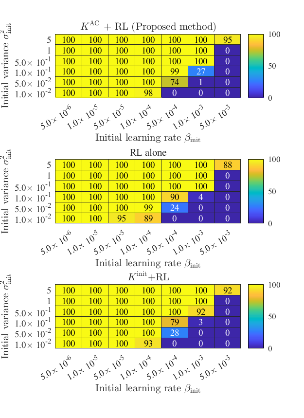   |  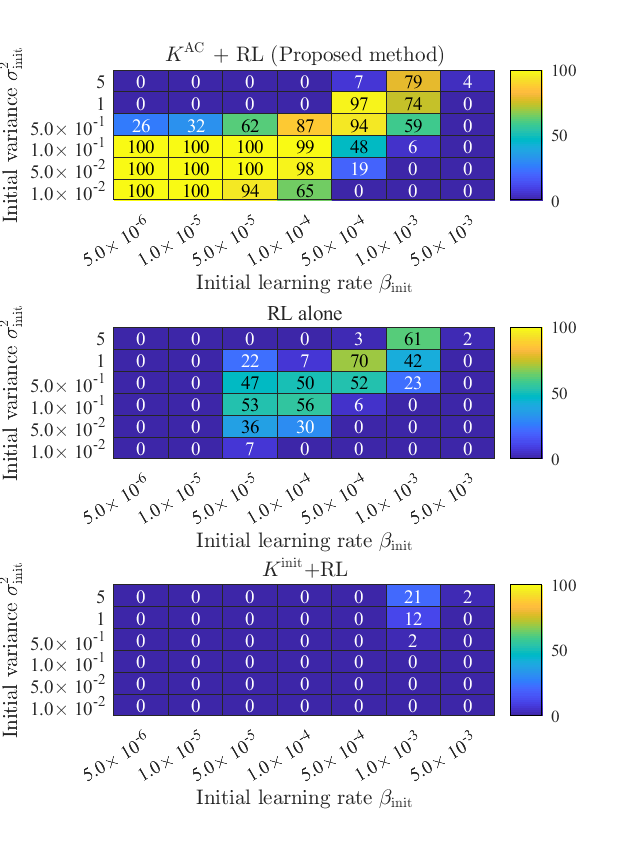   |

\# Please check the comments in the source code for further details.

# Contributors

The source code contained in this repository was made by the following contribuors. 

- Mei Minami (Keio University)
- Yuka Masumoto (Keio University)
- Yoshihiro Okawa (Fujitsu Limited)
- Tomotake Sasaki (Fujitsu Limited)
- Yutaka Hori (Keio University)

# BibTeX
```
@misc{minami2022twostep,
      author = {Minami, Mei and Masumoto, Yuka and Okawa, Yoshihiro and Sasaki, Tomotake and Hori, Yutaka},
      title={Two-step reinforcement learning for model-free redesign of nonlinear optimal regulator}, 
      howpublished={arXiv preprint, arXiv:2103.03808v2},
      year={2022}
}
```


# License
The source code contained in this repository is under the BSD 3-Clause Clear License. See [LICENSE](LICENSE) for details.


